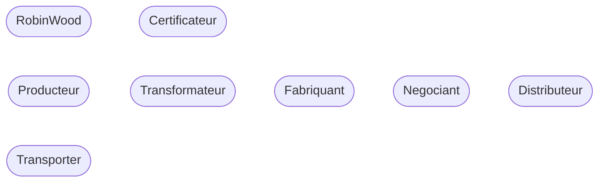
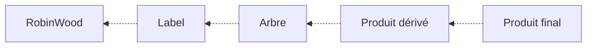
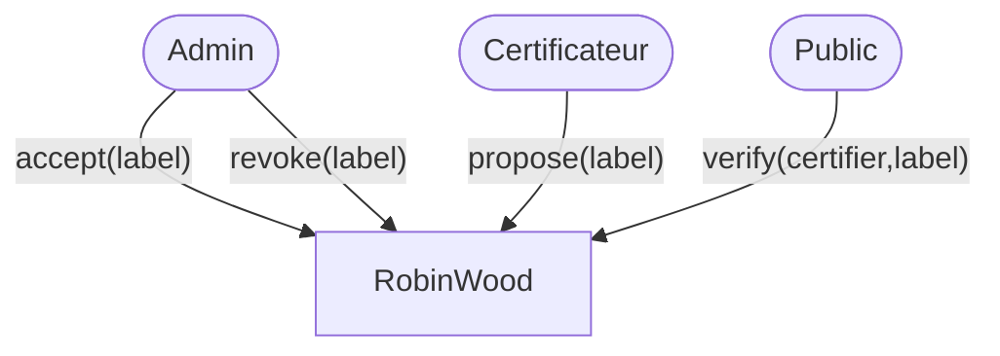
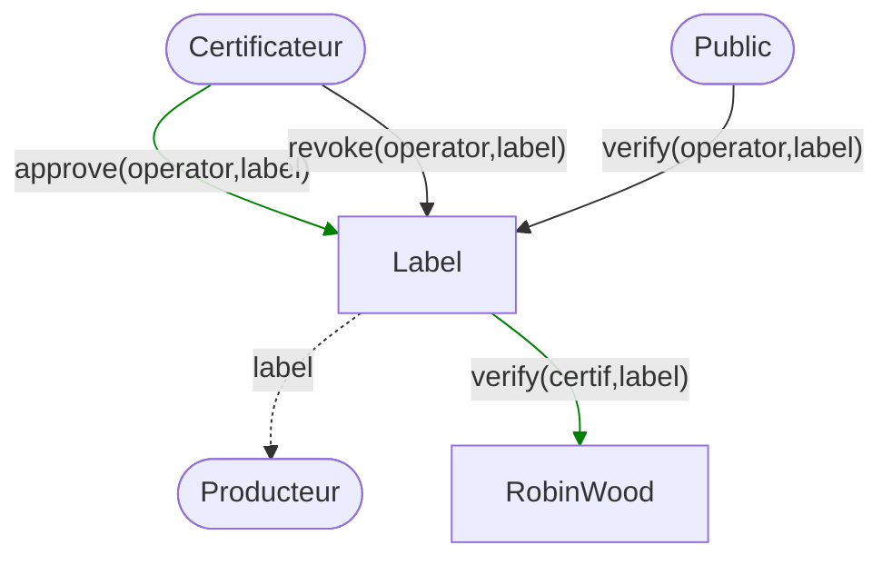
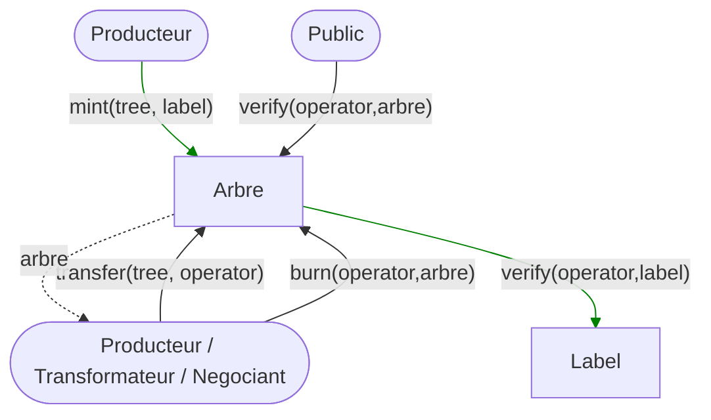
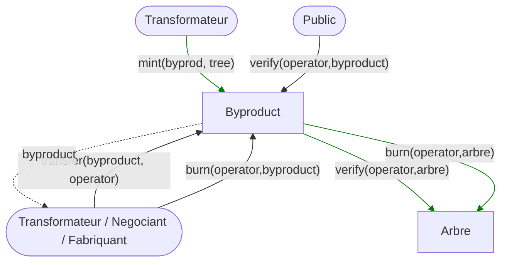
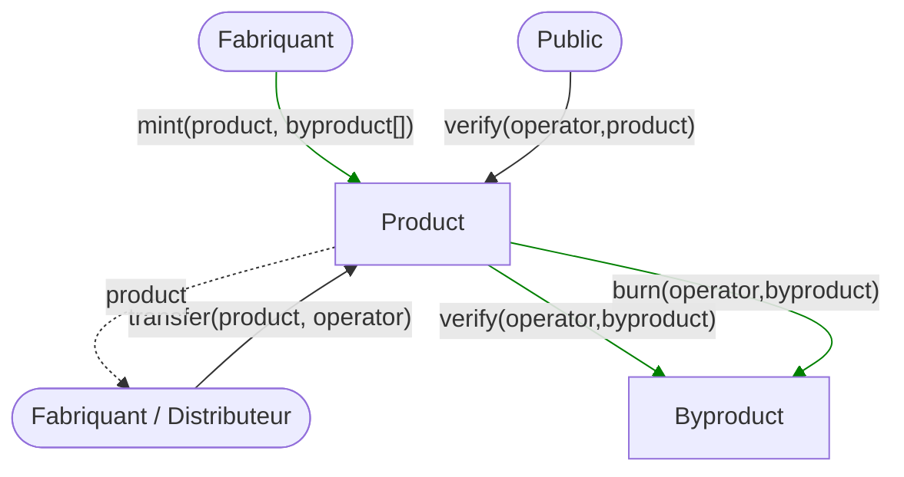

# Contracts architecture

## Acteurs

## Contrats

## Contrat RobinWood (ERC-721)

Premier contrat du système `RobinWood`, ce contrat permet de gérer des labels de qualité

1. Dans un premier temps, un entité délivrant des labels doit faire la demande de référencement de son/ses labels
2. Le système RobinWood accepte, ou non, les labels. Il pourra également les révoker par la suite (pouy le moment un admin, mais on pourrait imaginer une DAO)
3. Une fois accepté, l'entité propriétaire du label pourra désigner des producteurs pouvant l'utiliser, au travers du contrat `Label`

### Chart

### Interface

| Méthode                 | Description                        | Auth    |
| ----------------------- | ---------------------------------- | ------- |
| propose(label)          | Propose a new label                |         |
| approve(label)          | Approve a proposed label           | isOwner |
| revoke(label)           | Revoke an approved label           | isOwner |
| verify(operator, label) | Verify if an operator owns a label |         |

## Contrat Label (ERC-1155)

La contrat `Label` permet de gérer quels producteurs auront le droit d'utiliser un label.

1. Un certificateur doit approuver un producteur pour un label. Une vérification de propriété du label sera effectué sur le contrat `RobinWood`
2. Ce certificateur pourra également révoker les droits d'un producteur

ERC-720 ou ERC-1155 ?? comme un même peut etre délivré à plusieurs producteurs, un ERC-1155 semble plus adapté (sauf erreur d'interprétation)

### Chart

### Interface

| Méthode                  | Description                        | Auth                 |
| ------------------------ | ---------------------------------- | -------------------- |
| approve(operator, label) | Approve a operator                 | isApprovedLabelOwner |
| revoke(operator, label)  | Approve a operator                 | isApprovedLabelOwner |
| verify(operator, label)  | Verify if an operator owns a label |                      |

## Contrat Arbre (ERC-721)

Le contrat `Arbre` permet de créer un arbre dans RobinWood et de lui associer un label.

1. Un producteur `mint` un arbe avec la référence du label
2.

### Chart

### Interface

| Méthode                  | Description                         | Auth                       |
| ------------------------ | ----------------------------------- | -------------------------- |
| mint(tree, label)        | Mint a new tree                     | isVerified(operator,label) |
| transfer(tree, operator) | Transfer a tree to another operator | isOwner(tree)              |
| verify(operator,tree)    | Verify if an operator owns a tree   |                            |
| burn(operator,tree)      | Burn a tree                         | isOwner(tree)              |

## Contrat Produit Dérivé (ERC-721)

### Chart

### Interface

| Méthode                       | Description                              | Auth                      |
| ----------------------------- | ---------------------------------------- | ------------------------- |
| mint(byproduct, tree)         | Mint a new byproduct                     | isVerified(operator,tree) |
| transfer(byproduct, operator) | Transfer a byproduct to another operator | isOwner(byproduct)        |
| verify(operator,byproduct)    | Verify if an operator owns a byproduct   |                           |
| burn(operator,byproduct)      | Burn a byproduct                         | isOwner(byproduct)        |

## Contrat Produit Final (ERC-721)

### Chart

### Interface

| Méthode                     | Description                            | Auth                           |
| --------------------------- | -------------------------------------- | ------------------------------ |
| mint(product, byproduct)    | Mint a new final product               | isVerified(operator,byproduct) |
| transfer(product, operator) | Transfer a product to another operator | isOwner(product)               |
| verify(operator,product)    | Verify if an operator owns a product   |                                |

### Properties

| Properties                     | Description           |
| ------------------------------ | --------------------- |
| mapping(address => product_id) | Owner of a product_id |

## Gestion du transport
