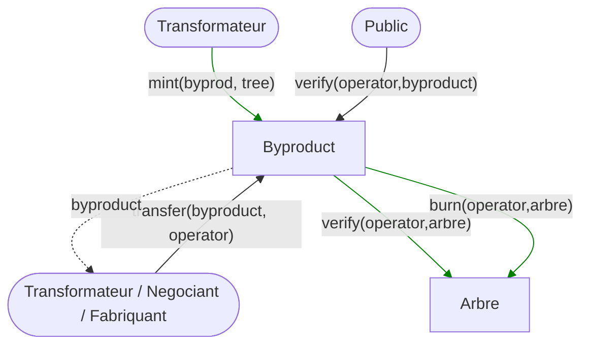

## Contracts architecture

### Acteurs

### Contrats

### Contrat Label

| Méthode                 | Description                        | Auth                 |
| ----------------------- | ---------------------------------- | -------------------- |
| propose(label)          | Propose a new label                |                      |
| approve(label)          | Approve a proposed label           | isOwner              |
| approve(operator)       | Approve a operator                 | isApprovedLabelOwner |
| verify(operator, label) | Verify if an operator owns a label |                      |

### Contrat Arbre

| Méthode                  | Description                       | Auth                       |
| ------------------------ | --------------------------------- | -------------------------- |
| mint(tree, label)        | Mint a new tree                   | isVerified(operator,label) |
| transfer(tree, operator) | Transfer a tree                   | isOwner(tree)              |
| verify(operator,arbre)   | Verify if an operator owns a tree |                            |

### Contrat Produit Dérivé

### Contrat Produit Final

