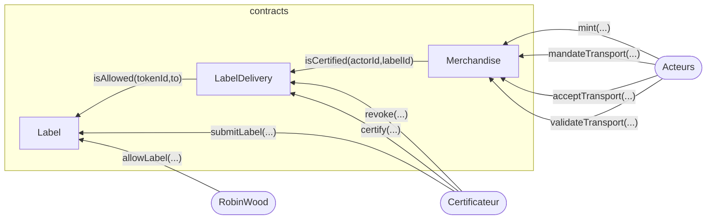

```mermaid
flowchart RL

  robin([RobinWood])
  certif([Certificateur])
  expl([Acteurs])

    label[Label]
    labeld[LabelDelivery]
    merch[Merchandise]

  certif -->|"submitLabel(...)"| label
  robin --> |"allowLabel(...)"| label

  certif -->|"certify(...)"| labeld
  certif -->|"revoke(...)"| labeld

  expl -->|"validateTransport(...)"| merch
  expl -->|"acceptTransport(...)"| merch
  expl -->|"mandateTransport(...)"| merch
  expl -->|"mint(...)"| merch

  subgraph contracts
    labeld -->|"isAllowed(tokenId,to)"| label
    merch -->|"isCertified(actorId,labelId)"| labeld
  end

```
