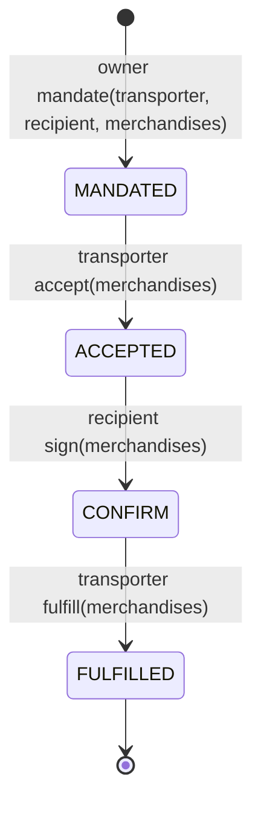

```mermaid
stateDiagram-v2

  [*] --> MANDATED: owner mandate(transporter, recipient, merchandises)
  MANDATED --> ACCEPTED: transporter accept(merchandises)
  ACCEPTED --> CONFIRM: recipient sign(merchandises)
  CONFIRM --> FULFILLED: transporter fulfill(merchandises)
  FULFILLED --> [*]

```
