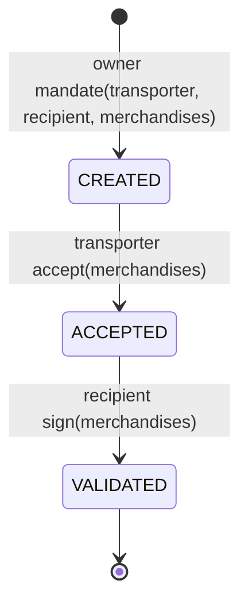

```mermaid
stateDiagram-v2

  [*] --> CREATED: owner mandate(transporter, recipient, merchandises)
  CREATED --> ACCEPTED: transporter accept(merchandises)
  ACCEPTED --> VALIDATED: recipient sign(merchandises)
  VALIDATED --> [*]

```
